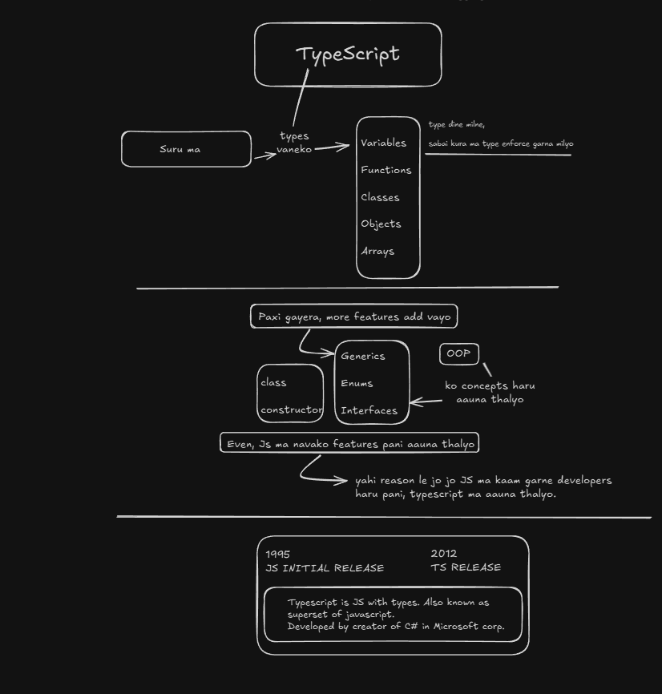
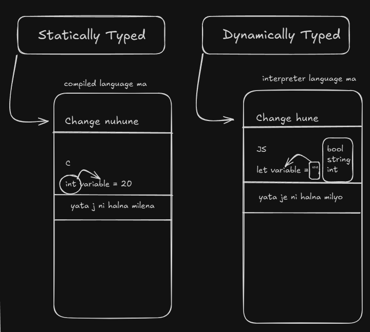
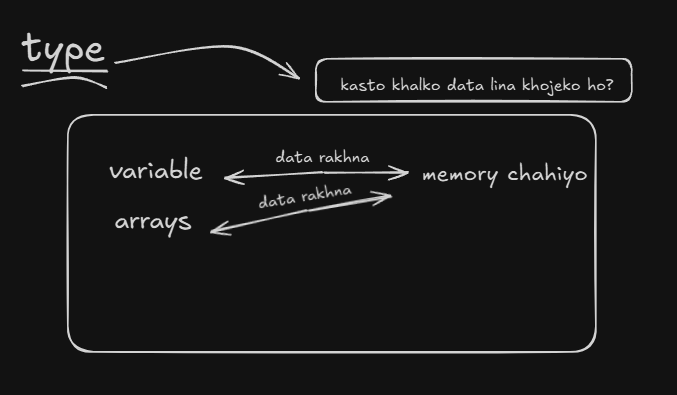

# 1 - Introduction to Typescript
## Today's Topic
### Day 1 - Friday, 2nd May 2025
#### Understanding Typescript
- Typescript is statically typed superset of JavaScript that compiles to plain JavaScript.
- While, JavaScript is dynamically typed, Typescript allows you to define types for variables, function parameters, and return values.

### Exploring typescript 

#### Why Typescript?
- TS was introduced to make js code predictable (dynamic typed) and to enhance DX for larger projects;
- Hence, reducing bugs and saving lots of compile time/run-time errors.
- Initially, made for this purpose only, now it has large number of functionalities such as interface, enums, custom types, utility types, etc. 

**Explanation** :
- Previously, JS was in the browser and was not used for large projects.
- Ryan Dahl (creator of Node.js) wanted to make JS more predictable and easier to work with, so he created Node.js with some extra code and features.
- Since, the engine was outside the browser, it was easier to add features to JS like manipulating files, etc.
- So, JS was used for large projects, but it was still dynamically typed and had no type checking.
- This made it difficult to work with large projects having to deal with type errors at runtime.
- Let's take an example of abstraction in js where one function is used for multiple purposes, but it is not clear what the function does or what type of data or parameters it takes. And, if we pass boolean instead of string, it will throw an error at runtime. Although, we can check the type of data using `typeof` operator, but it increases the complexity of the code and makes it less readable.
- Another example is of a fetch function that takes a URL and returns a response. Now, if the API is updated and the API returns object inside an array, when we expect an JSON object, it will throw an error at runtime. So, we need to check the type of data returned by the API and handle it accordingly. This increases the complexity of the code and makes it less readable.



#### How Typescript enhances development?
- **On-Fly error and type Checking.**
```javascript
// javascript code
function add(a, b) {
    return a + b;
}

add("1", 2); // returns "12" instead of 3
```

```typescript
//typescript code
function add(a: number, b: number) {
    return a + b;
}

add("1", 2); Argument of type 'string' is not assignable to parameter of type 'number'.
```
- **Code Readability && Quality.**
```javascript
// javascript code
function add(a, b) {
    let result;
    result = a + b;
    return result;
}

add(1, 2); // returns 3
```
```typescript
// typescript code
function add(a: number, b: number): number {
    let result: number;
    result = a + b;
    return result;
}

add(1, 2); // returns 3
```
- **Static && Dynamic Type supports.**


  - Typescript doesn't always enforce in programming.
  - Typescript can also be done in javascript way using 'any' type.
  - New comers of TS can use 'any' type for easier working in TypeScript.
  - So, Typescript support both static and dynamic typing.
  - Programming language that can support both static and dynamic typing is called "Gradually Typed Programming Language".
  - Gradually Typed Programming Language are:
    - TypeScript
    - Dart
    - Java
- **Compile(transpile) code to any version of JS.**
  - we can compile TS code to any version of JS such as ES5, ES6, ES7, etc.
  - Because, sometimes some people use old browsers that don't support ES6 or ES7, so we can compile TS code to ES5 and run it on old browsers.
  - And, also, we do not compile TS code but we **transpile it to JS code.**

