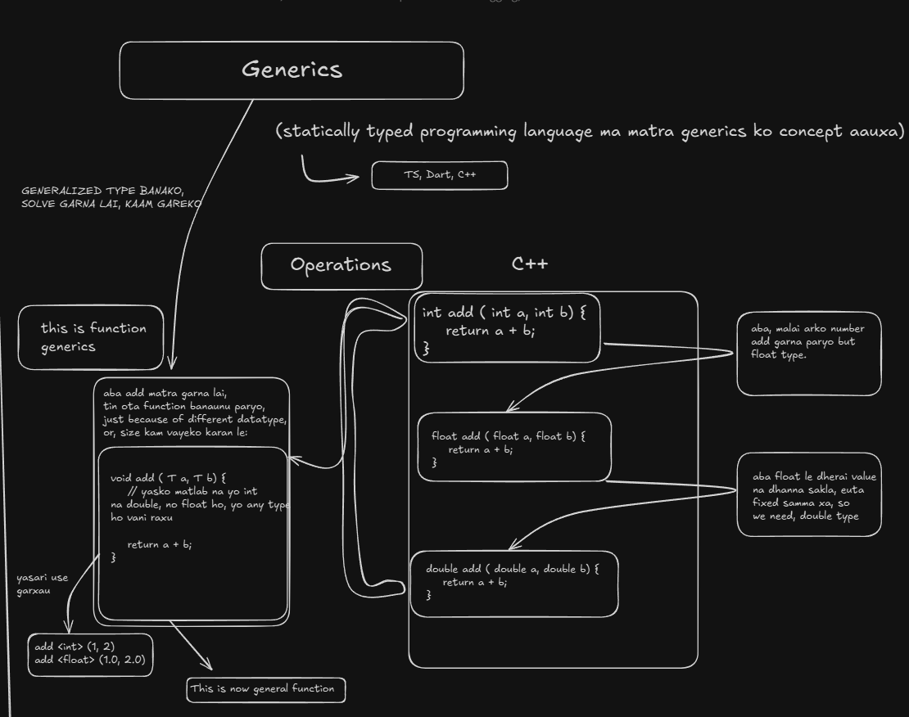

# 3 - More of a TypeScript: Enums, Generics, Types, Classes, etc. and TypeScript Installation
### Day 7 - Tuesday, 20th May 2025
#### Enums
- Suppose we need to store some data which kind of constant rated manner like 1-5
- We have a few options to store data in TypeScript:
  - **Arrays**: For storing collections of items.
  - **Objects**: For storing key-value pairs.
  - **Tuples**: For storing fixed-size arrays with different types.
  - **Enums**: For defining a set of named constants.
- But, finding right one for constant rated manner like 1-5 is a bit tricky.
- This is where Enums come in handy.
- Take this as an example:
```typescript
// Enum

// Suppose we need to store some data like marks here: 1-5
// One way to do this is to use variables
let marks1 = 1;
let marks2 = 3;
let marks3 = 5;

// the same code above can be written as this to store marks
let marks = [1, 3, 5]; // for storing in collections
// for storing list of items, arrays and collections came.

// This makes manipulating the data easier but what to do for constant rated manner like 1-5?

// or, if we need string in "HIGH", "LOW", "MEDIUM" manner?
```
- Enums are a way to define a set of named constants in TypeScript. They can be numeric or string-based.
```typescript
// Enum

// THESE ARE INTERRELATED DATA
const error = "ERROR";
const info = "INFO";

// Enums groups these interrelated constants together
enum LogType {
    ERROR = 10, // if we want to assign a specific value to the enum
    INFO,
    WARNING
}

console.log(LogType.ERROR) // 10
console.log(LogType.INFO) // 11
console.log(LogType.WARNING) // 12
```
- Enums are particularly useful in cases where if we need to change the value of the enum, which we can do it in one place and it will be reflected everywhere.
```typescript
// Enum
enum Salary {
  LOW = 1000,
  // MEDIUM = 2000,
  MEDIUM = 2500,
  HIGH = 3000
}

// now we are using salary in our code
let rishavSalary: number = Salary.HIGH;
let greshanSalary: number = Salary.MEDIUM;
let manavSalary: number = Salary.MEDIUM;

// now if i want to change the salary of medium to 2500 then we does not need to change it individually
// we can just change it in one place and it will be reflected everywhere
console.log(`Rishav's Salary: ${rishavSalary}`)
console.log(`Greshan's Salary: ${greshanSalary}`)
console.log(`manavSalary: ${manavSalary}`)
```
- One thing to note is that when we store custom value in enums, the next value will be incremented by 1. Because of this, we do not have to assign a value to each enum constant.
- But, if we want to assign a specific value other than numbers, like strings, then, we have to store strings in the other enum constant as well.
- Second thing, is enums are generally exported from a module and imported in another module for use. For instance, 
```typescript
export enum LogType {
  ERROR="ERRORS",
  INFO="INFO",
  WARNING="WARNING"
}
```

### Day 8 - Wednesday, 21st May 2025
#### Classes
- Classes are a way to define a blueprint for creating objects in TypeScript. They can have properties and methods.
- Properties are variables that belong to the class, and methods are functions that belong to the class.
- Classes can also have constructors, which are special methods that are called when an object is created from the class.
- Classes can also have access modifiers, which control the visibility of properties and methods.
- There are three access modifiers in TypeScript:
  - **public**: The property or method is accessible from anywhere. ``public`` is the default access modifier.
  - **private**: The property or method is only accessible from within the class. ``private`` is keyword for making functions or properties private.
  - **protected**: The property or method is only accessible from within the class and its subclasses. ``protected`` is keyword for making functions or properties protected.
- There is also ``static`` keyword which is used to define static properties and methods or variables. Static properties and methods are not tied to a specific instance of the class, but rather to the class itself. This means that they can be accessed without creating an instance of the class.
  - 
```typescript
class MatchScore {
  // private fields or private function is done by using # in javascript as well as typescript
  // but we can also use private keyword in typescript
  private score: number;
  // private function using # which is used in javascript
  #getScore(): number { // we can use: private getScore() {} as well
    return 100;
  }

  // if we want to make something public, we can use public keyword
  public getScore(): number {
    
  }

  // for defining a method, we do not use function keyword
  setScore(score: number) {
    // this is how we can access private fields
    console.log(this.#getScore());
  }
}

let match1 = new MatchScore();
match1.getScore();
```


```typescript
// static example
class MatchScore {
  static score = 1;

  public getScore(): number {
    return MatchScore.score;
  } 

  public incrementScore(): void {
    MatchScore.score++;
  }
}

const match1 = new MatchScore();
console.log(match1.getScore()); // 1

const match2 = new MatchScore();
match2.incrementScore(); // score ko value badaidyo

console.log(match1.getScore()); // 2
```

#### Generics
- Generics are a way to create reusable components in TypeScript. 
- They allow us to define a function or class that can work with multiple types without losing type safety.
- Generics are defined using angle brackets ``<>``.


- There are two types of Generics:
  - **Generic Functions**: Functions that can work with multiple types.
  - **Generic Class**: Classes that can work with multiple types.

```typescript
// Functional Generics

// for number
function swap(i1: number, i2: number) {
  return [i2, i1];
}

// for string
function swapString(i1: string, i2: string) {
  return [i2, i1];
}

// now, using Functional Generics
function swapGeneric<T>(a:T, b:T) {
  return [b, a];
}

// using, Generic Function
swapGeneric<string>("rishav", "greshan");
swapGeneric<number>(23, 5);

// now, if we need second parameter as number, first as any
function swapGeneric2<T>(a:T, b:number) {
  return [b, a];
}

swapGeneric2<string>("abcd", 345);

// now, for T, we can also write Type
function swapGeneric3<Type>(a:Type, b:string) {
  return [b, a];
}

swapGeneric3<number>(234, "dfjf");
```

```typescript
// Class Generics

class Box<T>{

  constructor(data:T) {
    console.log("data", data);
  }
}

const b = new Box<number>(5);
```
