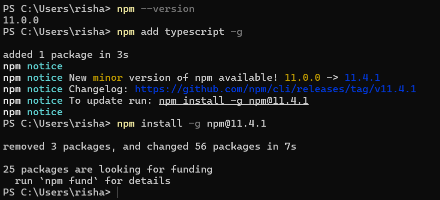
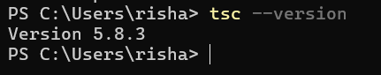
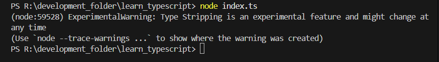
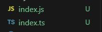
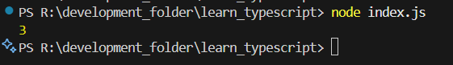
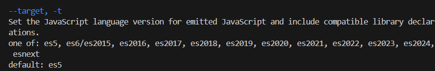
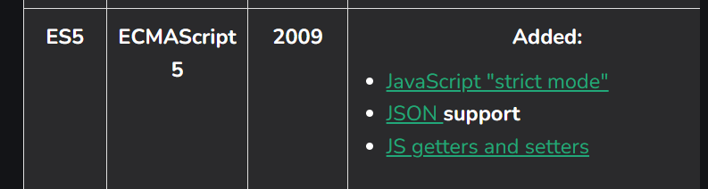

# 4 - Typescript Installation in Computer and Exploring tsconfig.json file
### Day 9 - Thursday, 22nd May 2025
#### Typescript Installation in Computer using Package Manager
- Using ``pnpm`` to install Typescript globally on your computer.
- Open your terminal and run the following command:
```zsh
pnpm add typescript -g
```
- For windows users, which i am one, instead of ``pnpm``, i will be using ``npm`` to install Typescript globally on my computer
```powershell
npm add typescript -g
```

- now, to check if typescript is installed successfully, run the following command in our terminal:
```powershell
tsc --version
```

- Now, we created a new file called ``index.ts`` in our project directory and added the following code:
```typescript
function add(a: number, b: number) {
    return a + b;
}
```
- and, now if we try to run the file using the command:
```powershell
node index.ts
```
- We will get an error message. Here is the screenshot of the error message:

- The error message may be different from others, because it showed experimentalwarning which means that node added a new feature regarding typescript. And, it may not be present in previous versions of node. i saw entirely different error message in youtube video, I learning from.
- Now, Since, typescript transpiles to javascript, we need to transpile the typescript code to javascript code and ``tsc`` is the command to transpile typescript code to javascript code:
```powershell
tsc index.ts
```
- Now, we can see the ``index.js`` file created in our project directory. Here is the screenshot of the file:

- now, we can run the javascript file using the command:
```powershell
node index.js
```

- Since, typescript is just for writing code, in easy, efficient and readable way, at the end of the day, it transpiles to javascript code. It is particulary useful for Large projects, where we need ``Object Oriented Programming`` and ``Static Typing``.
- For instance, ``classes`` was not in javascript at past. Right now, it is in javascript. But, previously, it was not. So, if we define a class in typescript, and even include ``access modifiers`` like ``private`` which is not in javascript, it will transpile the code to javascript code.
- Let's change the ``index.ts`` file to:
```typescript
class Product{
    private getProductList(){}
}
```
- Now if we transpile the code to javascript using ``tsc index.ts``, we can see the following code in the ``index.js`` file:
```javascript
var Product = /** @class */ (function () {
    function Product() {
    }
    Product.prototype.getProductList = function () { };
    return Product;
}());
```
- Now, again back to the same code in ``index.ts`` file:
```typescript
function add(a: number, b: number): number {
    return a + b;
}

console.log(
    add(1, 2)
);
```
- And, when we transpile the code to javascript, and use the command ``node index.js``, we can see the output:

- So, one thing we need to note is that, on which version of node, we are tranpiling the code to?
- So, By default, typescript transpiles the code to ES3 version of javascript. So, how to find that out?
```powershell
tsc --help
```
- It will show us the help page of typescript. And, various flags and what they do. There is a flag called ``--target``. It is used to specify the version of javascript we want to transpile our code to.

- From here, we see that, now, the default version of updated typescript which i am using is ES5. So, whatever code we write in typescript, it will transpiled to ES5 version of JavaScript.
- The same flag is used to specify the version of javascript we want to transpile our code to. 
