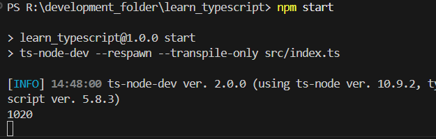

# 5 - TypeScript setting up for React and Node.js
## Day 10 - Friday, 23rd May 2025
### React for frontend with TypeScript
- While setting up the React project for frontend, we use either ``vite`` or ``create-react-app`` which are just bundling tools.
- For ``create-react-app``, we use the command:
```powershell
npx create-react-app <project_name>--template typescript
```
- For ``vite``, we use the command:
```powershell
npm create vite@latest
```
- Then, we enter the project name and select the framework as ``React`` and the variant as ``TypeScript``.


### Node.js for backend with TypeScript
- While working in Backend with Node.js, whenever we do a change in the code, we need to build the code again.
- So, in ``Node.js``, we generally use ``nodemon`` which detects the changes in the code and restarts the server automatically.
- So, if we want to setup ``typescript`` for backend with ``Node.js``, or want to build the code with ``typescript``, we use ``ts-node-dev`` library.
- ``ts-node-dev`` helps in running the ``typescript`` files that is in ``Node.js`` to ``javascript`` plus it does all in real-time. For instance, like nodemon features like restarting the server automatically as well as compiling the code in real-time.

- So, to initialize the ``Node.js`` project, we use the command:
```powershell
npm init -y
```
- Now, we see the ``package.json`` file created in the project folder.
- Now, assuming we are working in backend, in ``Node.js`` using ``typescript``, we will add ``ts-node-dev`` library to the project.
- We will open the ``package.json`` file and add the following code in the ``scripts`` section as mentioned in [ts-node-dev package (npm)](https://www.npmjs.com/package/ts-node-dev) :
```json
"start": "ts-node-dev --respawn --transpile-only server.ts"
```
- Here, we are assuming that we are working in backend in ``Node.js`` and using ``typescript``. That's why, we are using ``ts-node-dev`` library.
- We need to know that ``typescript`` is only required during development. After building, the code will be converted to ``javascript``, so we are using ``ts-node-dev`` library.
- Now, we need to install the ``ts-node-dev`` library in the project. In JSON, we just did the configuration part about if we run ``npm start``, it will run the ``ts-node-dev`` library. But, it is still not installed in the project.
- We need to install the ``ts-node-dev`` library as dev dependency in the project so ``-D`` is used.
```powershell
npm install -D ts-node-dev
```
- Now, for any application, there is a entry point. For example, in React, the entry point to application may be ``index.tsx`` or ``index.js``. The name may vary but the file is the entry point to the application, from where the application starts.
- ``ts-node-dev`` library will look for the entry point file in the project. Earlier, we wrote ``server.ts`` as the entry point file in the ``package.json`` file. Let's modify the file name to ``index.ts`` which is ``src/index.ts``.
```json
"scripts": {
    "test": "echo \"Error: no test specified\" && exit 1",
    "start": "ts-node-dev --respawn --transpile-only src/index.ts"
  },
```
- Now, run the command as ``node`` projects. Like:
```powershell
npm start
```


#### What's going on, behind the scenes ``ts-node-dev``?
- When we run the command ``npm start``, it will run the ``ts-node-dev`` library, which we configured in the ``package.json`` file which was ``ts-node-dev --respawn --transpile-only src/index.ts``.
- After running the command, it will look for the ``src/index.ts`` file and transpile the ``typescript`` code to ``javascript`` code.
- But, it will not create any ``.js`` file in the project. It will just transpile the code and run the code in memory.
- So, if we make any changes in the code, it will detect the changes, restart the server, and retranspile the code in memory.
- For instance, if we make a ``console.log("Rishav")`` in the ``src/index.ts`` file, and save the file, it will detect the changes, and restart the server automatically, and we could see the output in the terminal.

#### Building the code
- Now, how can we build the code? or, at least, the browser needs ``.js`` file to run the code, and even to be deployed in server.
- we can build the code using ``tsc`` command.
```powershell
tsc
```
- This will create a ``dist`` folder in the project, which will contain the ``.js`` files.
- BUT, we can do that in a better way.
- We can add a script in the ``package.json`` file to build the code.
```json
"scripts": {
    "test": "echo \"Error: no test specified\" && exit 1",
    "start": "ts-node-dev --respawn --transpile-only src/index.ts",
    "build": "tsc"
  },
```
- Now, we can run the command:
```powershell
npm run build
```
- Now, we see the ``dist`` folder created in the project, which contains the ``.js`` files.
