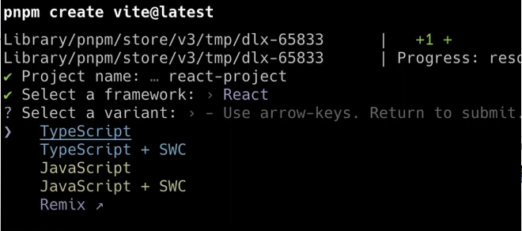

# 5 - TypeScript setting up for React and Node.js
## Day 10 - Friday, 23rd May 2025
### React for frontend with TypeScript
- While setting up the React project for frontend, we use either ``vite`` or ``create-react-app`` which are just bundling tools.
- For ``create-react-app``, we use the command:
```powershell
npx create-react-app <project_name>--template typescript
```
- For ``vite``, we use the command:
```powershell
npm create vite@latest
```
- Then, we enter the project name and select the framework as ``React`` and the variant as ``TypeScript``.


### Node.js for backend with TypeScript
- While working in Backend with Node.js, whenever we do a change in the code, we need to build the code again.
- So, in ``Node.js``, we generally use ``nodemon`` which detects the changes in the code and restarts the server automatically.
- So, if we want to setup ``typescript`` for backend with ``Node.js``, or want to build the code with ``typescript``, we use ``ts-node-dev`` library.
- ``ts-node-dev`` helps in running the ``typescript`` files that is in ``Node.js`` to ``javascript`` plus it does all in real-time. For instance, like nodemon features like restarting the server automatically as well as compiling the code in real-time.

- So, to initialize the ``Node.js`` project, we use the command:
```powershell
npm init -y
```
- Now, we see the ``package.json`` file created in the project folder.
- Now, assuming we are working in backend, in ``Node.js`` using ``typescript``, we will add ``ts-node-dev`` library to the project.
- We will open the ``package.json`` file and add the following code in the ``scripts`` section as mentioned in [ts-node-dev package (npm)](https://www.npmjs.com/package/ts-node-dev) :
```json
"start": "ts-node-dev --respawn --transpile-only server.ts"
```