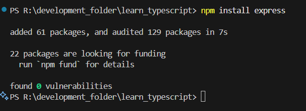
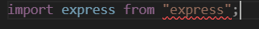
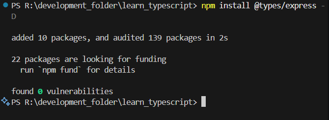
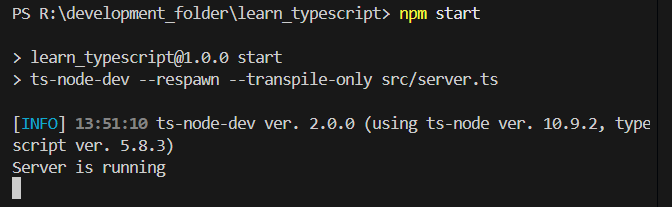
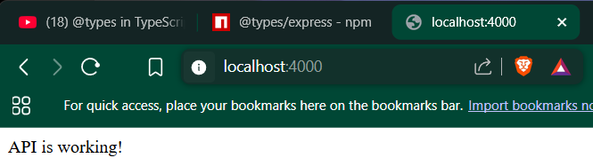

# 6 - @Types in TypeScript
## Day 11 - Monday, 24th May 2025
- Upto now, we are making our own custom types in TypeScript for many things like ``interface``, ``enums``, using ``type`` keyword.
- Now, what can we do of other libraries or packages that are in Internet such as ``express``, ``react``,etc.?
- For, all these Libraries, there is a github repository called [DefinitelyTyped](https://github.com/DefinitelyTyped/DefinitelyTyped), then, you can go to ``types`` folder, and search ``library_name``. Here, i will go to ``express`` folder, and then, i will see ``index.d.ts`` file. This file contains all the types of ``express`` library by a bot.

## Day 12 - Tuesday, 25th May 2025
### How can we use these types?
- To use libraries in Typescript, not only we need to install the library, but we also have to use the types of that library.
- We can install the types of a library by searching for ``@types/library_name`` in [npmjs.com](https://www.npmjs.com/package/@types/express) (here, I searched for ``@types/express``).
- For example, if we want to use ``express`` library, we have to install it using ``npm install express`` command, and then, we have to install the types of that library using ``npm install @types/express`` command.
- But, if we see the [npmjs.com/package/@types/express](https://www.npmjs.com/package/@types/express) installation command, we see that it wrote ``--save`` in between ``npm install`` and ``@types/express``.
- This is because, we use ``TypeScript`` in ``development`` mode, and we don't want to include the types in the production build. So, all the types are installed either using ``--save`` or ``-D`` flag.

#### Note:
- If, we are using a library that is already written in TypeScript, then we don't need to install the types of that library, because, the types are already included in the library.
- But, if we are using a library that is written in JavaScript, then we need to install the javascript library as well as the types of that library.
##### Example:
- Let's install the ``express`` library, and it's types in our project.
```powershell
npm install express # install the express library
npm install --save @types/express  # install the types of express library
```

- Since, now we installed ``express`` library, lets import it in our ``server.ts`` file.

- here, above, we see an red underlined in the ``express``. It is because, we have not imported the types of ``express`` library in our ``server.ts``.

- and, in the above, we installed the types of ``express`` library using:
```powershell
npm install @types/express -D # -D flag for development dependencies
```
- Now, let's try to make a simple server using ``express`` library.
```typescript
import express, {Request, Response} from "express"; // Here, {Request, Response} are the types of express library that is imported from the types of express library.

// now, lets's make a sample server
const app = express();

app.get("/", (req: Request, res: Response) => {
    res.send("API is working!");
});

app.listen(4000, () => {
    console.log("Server is running")
})
```

- Now, let's run the server using:
```powershell
npm start
```


- Now, let's go to browser and open ``http://localhost:4000/``.
